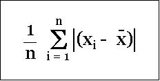
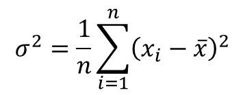
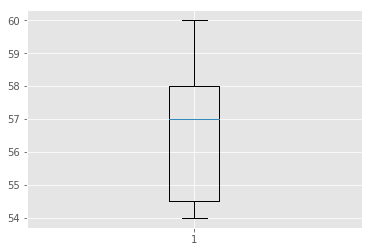
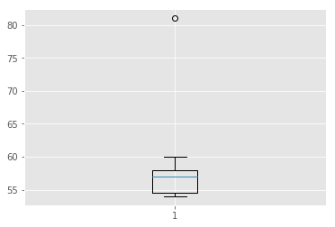

# Measures of Dispersion

## SWBATs

* Describe the significance of calculating measures of dispersion for continuous data
* Understand the formula and intuition behind mean absolute deviation, standard deviation and variance
* Understand the formula and intuition behind quantiles/quartiles and percentiles
* Understand and interpret Interquartile distances with box plots


### Introduction

In previous lesson, we learned about Measures of central tendency such as mean, median and mode. These metrics help give us a general understanding of where the values lie in the range of our data. However, they don't tell us the whole picture, and can often be misleading. 

To truly understand our data, we also need **Measures of Dispersion**, namely, Absolute Deviation, Standard Deviation and Variance. These measures tell us how tightly or loosely clustered around the center our data is, and generally act as a measure of how "noisy" our dataset is or isn't.

In this lesson, we'll learn about these measures of dispersion, and explore the relationship between them, as well as their relationship with other summary statistics.


### Abolute Deviation

**Absolute deviation** is the simplest way of calculating the dispersion in a dataset. This is calculated by taking a value from the data and subtracting the mean score. This helps identify the distance between a given value and mean i.e. how much the value deviates from the mean -  

> $|x_i - \bar{x}|$

Note: Bars are used for absolute values when we are not considering positive vs. negative deviation

For example, Consider the mean score for the group of 100 students is 58.75 out of 100. If we took a student that scored 60 out of 100, the deviation of a score from the mean is 60 - 58.75 = 1.25. 

**Average Absolute Deviation** of a dataset is calculated by taking mean of individual deviations of all data elements as shown in the formula below:



Here **xi = [x1, x2, .., xn]** , where n is the number of observations. x-bar is the mean calculated over the dataset.

## Variance

A more complex measure of dispersion is Variance. Unlike the absolute deviation, which uses the absolute value of the deviation in order to take care of the negative values, the variance achieves positive values by squaring each of the deviations instead. Adding up these squared deviations gives us the **sum of squares**, which we can then divide by the total number of values in our data.  Variance can be calculated with the formula:



Here the variance (σ2: sigma-squared), is achieved by: 
* subtracting mean value (shown as mu) from each element in turn
* squaring the result (to remove the negative sign) and adding to a total
* dividing by total number of observations

As a measure of dispersion, the variance is very useful. If the values in the data are spread out, the variance will be a large number. On the other hand, if the values are spread closely around the mean, the variance will be a much smaller number. 

There are, however, two potential problems with the variance. First, because the deviations of values from the mean are 'squared', this gives more weight to extreme scores. Outliers in the data can also impact variance. Secons, the variance is not in the same units as the values in our data set. Variance is measured in the units **squared**. This means we cannot directly relate variance value to the values in our data set. 

Calculating the standard deviation rather than the variance rectifies this problem. 

### Standard Deviation

The standard deviation is another measure of the spread of values within a set of data. 
It is simply the square root of the variance. In the above formula, σ is the standard deviation and σ2 is the variance. 


One of the common applications of calculating standard deviation is statistical inference.  we are often presented with data from a sample only, we can estimate the population standard deviation from a sample standard deviation. These two standard deviations - sample and population standard deviations - are calculated slightly differently as we shall see ahead. 


#### Quantiles. Percentiles and Quartiles

**Quantiles** are points in a distribution that relate to the rank order of values in that distribution. We can find any quantile by sorting the sample. The middle value of the sorted sample (middle quantile, 50th percentile) is known as the **median**. The **limits** are the **minimum** and **maximum** values. Any other locations between these points can be described in terms of **percentiles**.

Percentiles are descriptions of quantiles relative to 100. So the 80th percentile is 80%  of the way up an ascending list of sorted values of data. 


So above would mean that you are on 80th percentile and 80% of people in the data are shorter than you.  

### InterQuantile Range - IQR
The **quartiles** of a data set divides the data into four equal parts, with one-fourth of the data values in each part. The second quartile position is the median of the data set, which divides the data set in half as shown for a simple dataset below:


The **interquartile range (IQR)** is a measure of where the “middle fifty” is in a data set. Where a range is a measure of where the beginning and end are in a set, an interquartile range is a measure of where the bulk of the values lie. That’s why it’s preferred over many other measures of spread (i.e. the average or median) when reporting things like average retirement age and scores in a test etc. 

#### Calculating IQR for a given data set. 

Let's look at the steps for calculating IQR for ODD number of elements. 
```
Data = 1, 5, 2, 7, 6, 12, 15, 18, 9, 27, 19
Step 1: Put the given numbers in order.
1, 2, 5, 6, 7, 9, 12, 15, 18, 19, 27.

Step 2: Find the median.
1, 2, 5, 6, 7, 9, 12, 15, 18, 19, 27.

Step 3: Place parentheses around the numbers above and below the median. 
Not necessary statistically, but it makes Q1 and Q3 easier to spot.
(1, 2, 5, 6, 7), 9, (12, 15, 18, 19, 27).

Step 4: Find Q1 and Q3
Think of Q1 as a median in the lower half of the data and think of Q3 as a median for the upper half of data.
(1, 2, 5, 6, 7),  9, ( 12, 15, 18, 19, 27). Q1 = 5 and Q3 = 18.

Step 5: Subtract Q1 from Q3 to find the interquartile range.
18 – 5 = 13.
```
---

For caluclating IQR for even number of elements present in data , the process is slightly modified as below:
```
Let's find the IQR for the following data set: 3, 5, 7, 8, 9, 11, 15, 16, 20, 21.

Step 1: Put the numbers in order.
3, 5, 7, 8, 9, 11, 15, 16, 20, 21.

Step 2: Make a mark in the center of the data:
3, 5, 7, 8, 9, | 11, 15, 16, 20, 21.

Step 3: Place parentheses around the numbers above and below the mark you made in Step 2–it makes Q1 and Q3 easier to spot. 
(3, 5, 7, 8, 9), | (11, 15, 16, 20, 21).

Step 4: Find Q1 and Q3
Q1 is the median (the middle) of the lower half of the data, and Q3 is the median (the middle) of the upper half of the data.
(3, 5, 7, 8, 9), | (11, 15, 16, 20, 21). Q1 = 7 and Q3 = 16.

Step 5: Subtract Q1 from Q3 for IQR
16 – 7 = 9.
```

The above behavior of IQR is graphically depicted below: 


### Visualizing Dispersion with Box Plots

Box plot is a visual representation of centrality and spread of data in following 5 terms (also known as 5-point statistics).

* Minimum: the minimum number in the data set
* Maximum: the maximum number in the data set
* Median: If data set is arranged in ascending order, what is the middle number
* First Quartile: If data set is arranged in ascending order, the 25% of data is below it
* Third Quartile: If data set is arranged in ascending order, the 75% of data is below it

They enable us to study the distributional characteristics of a group of scores as well as the level of the scores. A general depiction of a box plot is shown below:


When creating box plots, scores are first sorted. Then four equal sized groups are made from the ordered scores. That is, 25% of all scores are placed in each group. The lines dividing the groups are called quartiles, and the groups are referred to as quartile groups. Usually we label these groups 1 to 4 starting at the bottom. Matplotlib has a built in function to create such box plots. Let's create a box plot for the retirement dataset we talked about earlier (including the outlier):


```python
import matplotlib.pyplot as plt
plt.style.use('ggplot') # for viewing a grid on plot
x = [54, 54, 54, 55, 56, 57, 57, 58, 58, 60, 81]
plt.boxplot(x,  showfliers=False)
plt.title ("Retirement Age BoxPlot")
plt.show()
```





In this simple box plot we can see that it is very simple to visually inspect the central tendency of the data with a median (drawn as blue line) at 57. The IQR to identify the 50% of the data (shown as a box). The **whiskers** (two horizontal lines) showing the minimum (54) and maximum (60) values in our dataset. 

#### So what happened to the outlier?

See that argument `showfliers=False`, it is used to eliminate the outliers from the plot, let's remove this and see if can see our outlier. 


```python
plt.boxplot(x)
plt.title ("Retirement Age BoxPlot - with outliers")
plt.show()
```





There it is , the white dot at the top. So you see how we can use boxplot along with other techniques for identifying the central and dispersion tendencies in a given dataset. We shall revisit this again in the course and will see how these techniques are used towards effective data analysis. 

## Summary

Building up from the previous lesson in measures of central tendency, this lesson introduced some measures of identifying the spread or deviation present in the data. We also looked quartiles, IQR and how to use box plots to visually inspect the data distributions. We shall build upon these basic ideas as we take a deep dive into statistics later on. 
